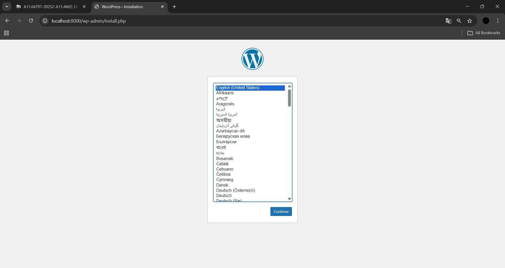
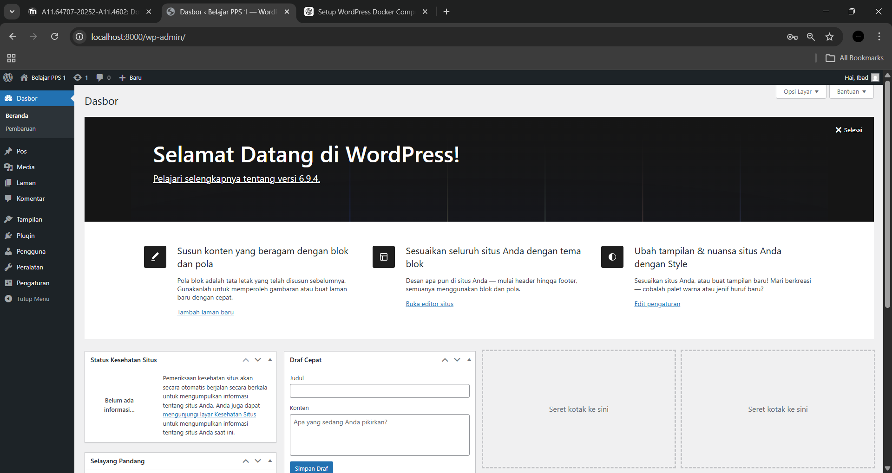
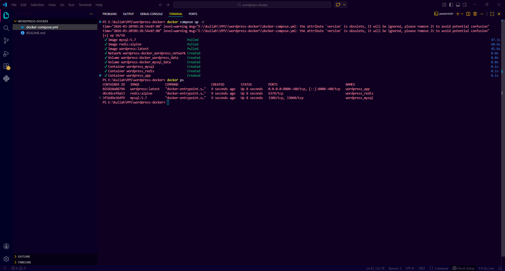
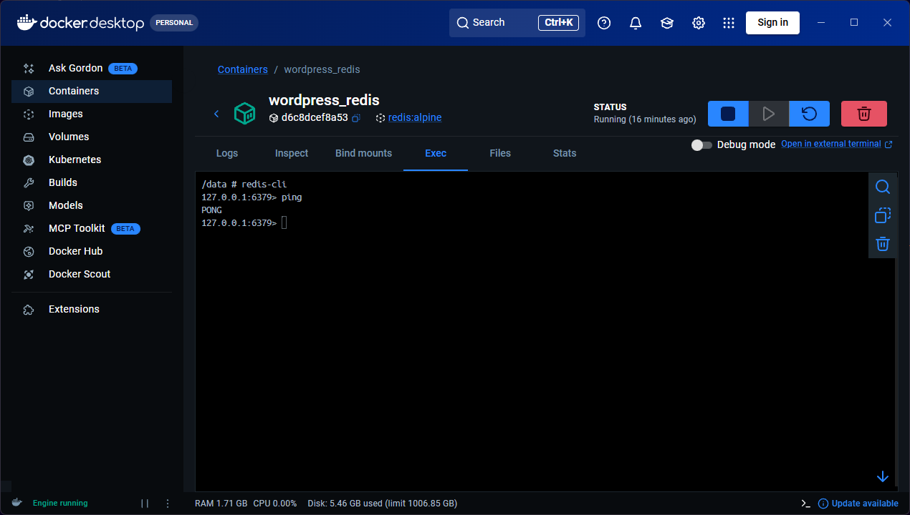

# WordPress Docker Compose (WordPress + MySQL + Redis)

Project ini merupakan implementasi **multi-container orchestration** menggunakan Docker Compose dengan stack:
- WordPress (CMS)
- MySQL (Database)
- Redis (Object Cache)

---

## 👨‍💻 Author

Nama: Mahammad Ibadullah  
NIM: A11.2023.15275  

---

## 🎯 Learning Objectives

- Memahami multi-container dengan Docker Compose  
- Menggunakan `depends_on` untuk dependency service  
- Docker networking antar container  
- Volume untuk data persistence  
- Konfigurasi environment variables  
- Integrasi Redis sebagai object cache  

---

## 📦 Tech Stack

- Docker  
- Docker Compose  
- WordPress (latest)  
- MySQL 5.7  
- Redis (alpine)  

---

## 📁 Struktur Project


wordpress-docker/
│
├── docker-compose.yml
└── README.md


---

## ⚙️ Konfigurasi docker-compose.yml

```yaml
version: '3.8'

services:

  wordpress:
    image: wordpress:latest
    container_name: wordpress_app
    ports:
      - "8000:80"
    environment:
      WORDPRESS_DB_HOST: mysql:3306
      WORDPRESS_DB_NAME: wordpress_db
      WORDPRESS_DB_USER: wordpress_user
      WORDPRESS_DB_PASSWORD: wordpress_password
    depends_on:
      - mysql
      - redis
    volumes:
      - wordpress_data:/var/www/html
    networks:
      - wordpress_network

  mysql:
    image: mysql:5.7
    container_name: wordpress_mysql
    restart: always
    environment:
      MYSQL_ROOT_PASSWORD: rootpassword
      MYSQL_DATABASE: wordpress_db
      MYSQL_USER: wordpress_user
      MYSQL_PASSWORD: wordpress_password
    volumes:
      - mysql_data:/var/lib/mysql
    networks:
      - wordpress_network

  redis:
    image: redis:alpine
    container_name: wordpress_redis
    restart: always
    networks:
      - wordpress_network

volumes:
  wordpress_data:
  mysql_data:

networks:
  wordpress_network:
▶️ Cara Menjalankan Project
1. Jalankan Container
docker compose up -d
2. Cek Container
docker ps

Harus muncul:

wordpress_app

wordpress_mysql

wordpress_redis

3. Akses WordPress

Buka di browser:

http://localhost:8000

Kemudian ikuti langkah-langkah instalasi.

🔴 Setup Redis Object Cache
1. Install Plugin

Login ke WordPress: /wp-admin

Plugins → Add New

Cari: Redis Object Cache

Install & Activate

2. Konfigurasi Redis

Masuk ke container:

docker exec -it wordpress_app bash

Edit file:

vi wp-config.php

Tambahkan:

define('WP_REDIS_HOST', 'redis');
define('WP_REDIS_PORT', 6379);
3. Aktifkan Redis

Settings → Redis

Klik Enable Object Cache

## 📸 Lampiran

### 1. Halaman Instalasi


### 2. Halaman Dashboard


### 3. Docker Container


### 4. Redis Ping

---

## ❓ Pertanyaan

### 1. Kenapa perlu volume untuk MySQL?
Volume digunakan agar data database tidak hilang saat container dihentikan atau dihapus. Data disimpan di luar container.

---

### 2. Apa fungsi `depends_on`?
`depends_on` digunakan untuk mengatur urutan startup container, sehingga WordPress menunggu MySQL dan Redis berjalan terlebih dahulu.

---

### 3. Bagaimana cara WordPress container connect ke MySQL?
WordPress menggunakan hostname dari nama service di Docker:

```bash
WORDPRESS_DB_HOST=mysql:3306
Docker network memungkinkan komunikasi antar container menggunakan nama service.

### 4. Apa keuntungan pakai Redis untuk WordPress?
`Mempercepat loading website

Mengurangi beban database

Menyimpan cache object

Meningkatkan performa WordPress
---